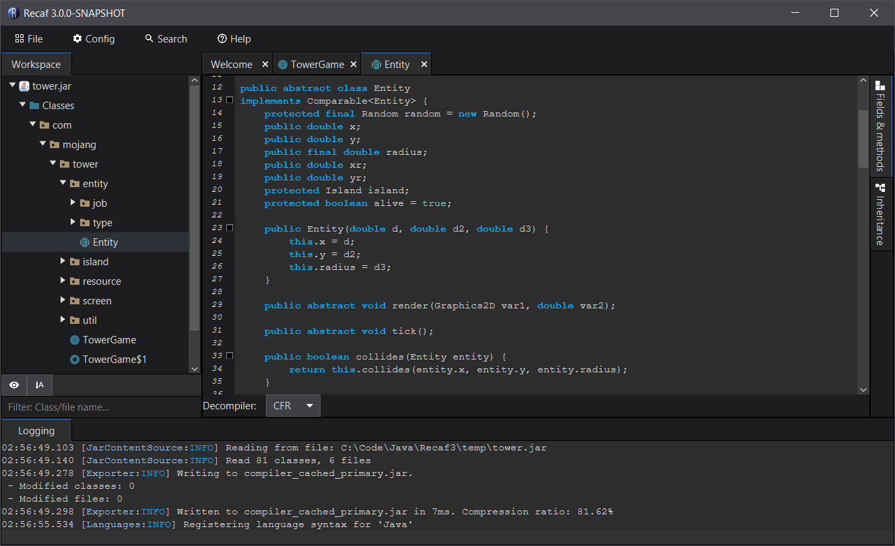

# Recaf 3X 

This repository is a temporary one for staging snapshot previews of the 3X branch. 
It also helps organize issues by delegating them to one place without cluttering up issues affecting the current 2X ones in the main repo.

The purpose of these snapshot previews is to gather feedback and opinions. Try it out and let us know what you think about it.

## Download

Get it here: [3X Snapshot releases](https://github.com/Col-E/recaf-3x-issues/releases)

## Important links

* Source: [3X branch](https://github.com/Col-E/Recaf/tree/dev3)
* Issues: [3X issues](https://github.com/Col-E/recaf-3x-issues/issues)
* Discord: 

## FAQ

* Is 3X usable right now?
    * Yes, but we're going through testing of the main features in order to catch bugs prior to an official release
* When will 3X be done?
    * Projects like this are never _"done"_. They just improve with time. That being said, 3.0.0 will be released when all of the basic features are implemented and no obvious bugs appear during regular usage.
    * The major remaining components needing bug-testing and validation are: Instrumentation (Agent/attach), SSVM
    * Documentation for 3X needs to be created over on [Recaf Documentation](https://github.com/Col-E/Recaf-documentation)
* What will the 2X --> 3X update process look like?
    * We will create a final 2X release that will change the update process to do the following:
        * Notify that the next update to 3X will bring significant changes _(But in a good way)_
        * Notify that Java 11 is required _(Skipped if user is on Java 11 already)_
            * Warn about `JAVA_HOME` in addition to current JVM if they are not the same path.
        * Prompt to update to 3X, or to ignore the update all together.
        * Upon acceptance, setup usage of the Recaf 3X launcher instead of Recaf 3X directly so that the update process is handled externally
        * Close 2X, run the new launcher.
    * In case the user uses an old version, its really on them if the update process doesn't work. 
        * It will attempt to do `java -jar <recaf>` on the new jar, which should work if they're already on Java 11. Though they will not be using the launcher in this case.
        * If they are on Java 8, it will probably fail in some regard and be up to the user to resolve.

## Progress

This table is a _very brief_ overview of the current state of 3X. It does not cover all of Recaf's existing features, nor does it cover all of the upcoming new features. 

| Feature Name                | Completed?         | Progress                                                     |
| --------------------------- | ------------------ | ------------------------------------------------------------ |
| Assembler                   | :heavy_check_mark: | Feature complete, focusing on fixes.                         |
| Android support             | :grey_question:    | Basic Android support exists for APK files, but a lot of the UI has not been fully integrated, so there's some menus that do not function. |
| Compiler support            | :heavy_check_mark: | Classes in the workspace can be modified via decompiling and recompiling. |
| Attaching / Agent support   | :grey_question:    | The basic capability is added, but needs some polish to fix up bugs and clear up UX. |
| Decompile support           | :heavy_check_mark: | Decompiler integration is in. Currently supports CFR, Procyon, QuiltFlower, and fallback options. Contextual actions are available on classes, fields, and methods assuming the decompiled code is parsable. |
| Hex editor support          | :heavy_check_mark: | The hex editor has been redesigned from the ground up. It now comes with a string dumper, value inspector, and other helpful tools for class files. |
| Natives / PE/ELF viewer     | :heavy_check_mark: | There is support for viewing both PE headers _(DLL/EXE, most useful for imported functions)_ and ELF headers. |
| Inheritance graphing        | :heavy_check_mark: | When viewing a class you can see its parent and child classes/interfaces |
| Manual remapping support    | :heavy_check_mark: | Remapping is internally supported and integrated. Right clicking on classes/fields/methods allows renaming of each item. |
| Automated remapping support | :heavy_check_mark: | Batch remapping from mapping files is implemented, though file formats will need to be ported over to the new system. |
| Generative mapping suppor t | :heavy_check_mark: | New mappings can be generated on the fly with the new built in auto-mapper. You can specify filters to narrow down what gets mapped and the kind of naming scheme you wish to apply. |
| Persistent config           | :heavy_check_mark: | The system for saving configuration values is done. Some UI elements are missing though. |
| Dockable panels             | :heavy_check_mark: | In 3X all tabs have built in docking support. You can drag a tab out of the window to create a new window, snap tabs to split a window into halves, and more. |
| Phantom class generation    | :heavy_check_mark: | The feature that lets you generate missing classes _(Used heavily to enable compiling against code you don't have)_ is fully ported over. |
| Custom themes               | :x:                | No progress has been put into supporting changing the default dark theme yet. |
| Custom translations         | :heavy_check_mark: | Multiple languages are almost fully translated and swapping between them has been implemented. |
| Virtualization              | :heavy_check_mark: | Virtualization driven method call simulation and code deobfuscation are available in the UI. SSVM powers the virtualization. Since native API's are re-implemented in Java only supported systems can be virtualized (Which is good from a security standpoint). |
| Plugin support              | :heavy_check_mark: | The plugin API has been fleshed out, and the plugin manager is accessible via the UI. More things like browsing public plugins, a more fleshed out API, etc will after the first release of 3X. |
| Script support              | :heavy_check_mark: | The script menu lets you edit/load files and execute them using Beanshell. `-s <file>` command line flag runs a script on startup. |
