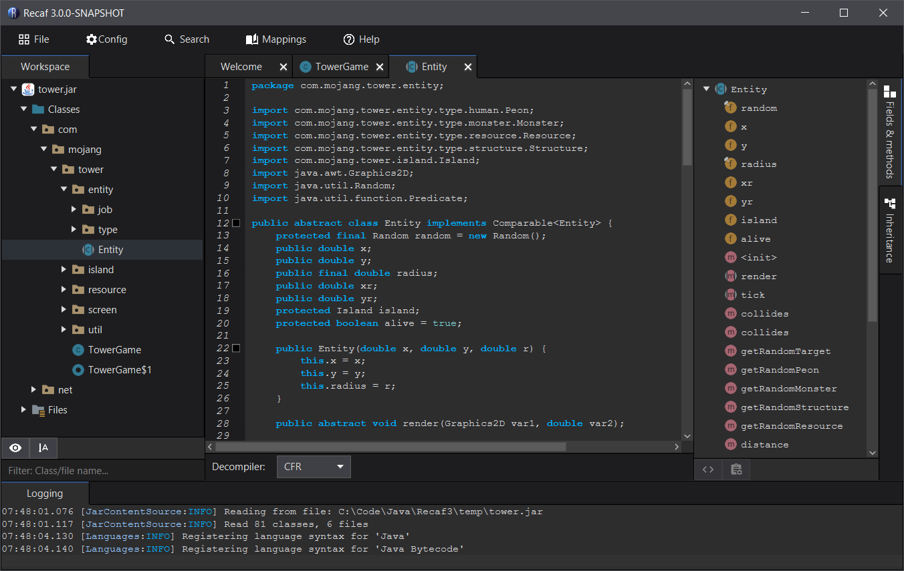

# Recaf 3X 

This repository is a temporary one for staging snapshot previews of the 3X branch. 
It also helps organize issues by delegating them to one place without cluttering up issues affecting the current 2X ones in the main repo.

The purpose of these snapshot previews is to gather feedback and opinions. Try it out and let us know what you think about it.

## Download

Get it here: [3X Snapshot releases](https://github.com/Col-E/recaf-3x-issues/releases)

## Important links

* Source: [3X branch](https://github.com/Col-E/Recaf/tree/dev3)
* Issues: [3X issues](https://github.com/Col-E/recaf-3x-issues/issues)
* Discord: 

## FAQ

* Is 3X usable right now?
    * Technically yes, but its missing a few of the core features. 
* When will 3X be done?
    * Projects like this are never _"done"_. They just improve with time. That being said, 3.0.0 will be released when all of the basic features are implemented. 

## Progress

This table is a _very brief_ overview of the current state of 3X. It does not cover all of Recaf's existing features, nor does it cover all of the upcoming new features. 

| Feature Name                | Completed?         | Progress                                                     |
| --------------------------- | ------------------ | ------------------------------------------------------------ |
| Assembler                   | :heavy_check_mark: | Mostly complete, some quality of life and other fixes still pending.           |
| Android support             | :grey_question:    | Some basic outline of android support exists, but has not been integrated into the UI significantly. You can open APK files, but there is no editing support at the moment. |
| Compiler support            | :heavy_check_mark: | Classes in the workspace can be modified via decompiling and recompiling. |
| Attaching / Agent support   | :x:                | No progress has been put into porting over agent capabilities yet. The way it is done in 2X is quite messy to be fair, and in 3X the plan will be to implement it in a cleaner and more flexible way _(Supporting attaching to even remote processes over a LAN)_. |
| Decompile support           | :heavy_check_mark: | Decompiler integration is in. Currently only CFR is supported, but adding others is an easy task. Contextual actions are available on classes, fields, and methods assuming the decompiled code is parsable. |
| Hex editor support          | :heavy_check_mark: | The hex editor has been redesigned from the ground up. It now comes with a string dumper, value inspector, and other helpful tools for class files. |
| Natives / PE/ELF viewer     | :heavy_check_mark: | There is support for viewing both PE headers _(DLL/EXE, most useful for imported functions)_ and ELF headers. |
| Inheritance graphing        | :heavy_check_mark: | When viewing a class you can see its parent and child classes/interfaces |
| Manual remapping support    | :heavy_check_mark: | Remapping is internally supported and integrated. Right clicking on classes/fields/methods allows renaming of each item. |
| Automated remapping support | :heavy_check_mark: | Batch remapping from mapping files is implemented, though file formats will need to be ported over to the new system. |
| Persistent config           | :heavy_check_mark: | The system for saving configuration values is done. Some UI elements are missing though. |
| Dockable panels             | :heavy_check_mark: | In 3X all tabs have built in docking support. You can drag a tab out of the window to create a new window, snap tabs to split a window into halves, and more. |
| Phantom class generation    | :heavy_check_mark: | The feature that lets you generate missing classes _(Used heavily to enable compiling against code you don't have)_ is fully ported over. |
| Custom themes               | :x:                | No progress has been put into supporting changing the default dark theme yet. |
| Custom translations         | :heavy_check_mark: | Multiple languages are almost fully translated and swapping between them has been implemented. |
| Plugin support              | :grey_question:    | The plugin API has been fleshed out, but not implemented into the UI. Hopefully once it is completed you will be able to more easily load and unload plugins _(And browse existing supported plugins)_. |
| Script support              | :heavy_check_mark: | The script menu lets you edit/load files and execute them using Beanshell. `-s <file>` command line flag runs a script on startup. |
